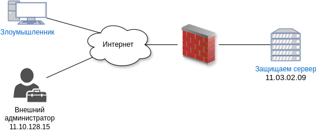

# Лабораторная работа 

## Задание 

> Пусть есть сервер с адресом 11.03.02.09, 
использующий порты SSH-22 (управление серверов) 
и HTTP-80 (общедоступное API) и HTTP-9000 (метрики), 
все подключения к которому проходит через МСЭ. 
Администратор подключается с 11.10.138.15 для управления сервером по SSH.



Необходимо сделать:
-	Чтобы злоумышленник не мог использовать сканер безопасности, читать метрики и управлять сервером, необходимо для всех пользователей, кроме администратора, был доступен толь порт 80;
- Для избежания флуд атаки, необходимо ограничить количество пакетов, посылаемых на сервер;
- Запретить фрагментации пакетов.

## Подготовка к лабораторной работы
### Установка
В лабораторной работе будет использовать технологии [`docker`](https://docs.docker.com/engine/install/ubuntu/#install-using-the-repository) и [`containerlab`](https://containerlab.dev/install/#install-script).
Для их установки необходимо ввести:
```bash
$ sudo apt-get install -y docker-ce docker-ce-cli containerd.io docker-buildx-plugin docker-compose-plugin
$ curl -sL https://get.containerlab.dev | sudo bash
```
### Создание конфигурационного файла
Конфигурационный файл должен быть назван `lab.clab.yml`:

[Файл конфигурации](./lab.clab.yml)

### Запуск стенда
Необходимо вызвать команду:
```bash
$ containerlab deploy
```

В результате должна появиться следующая таблица:

| # |         Name          | Container ID |              Image               | Kind  |  State  |  IPv4 Address  |     IPv6 Address     |
|---|-----------------------|--------------|----------------------------------|-------|---------|----------------|----------------------|
| 1 | clab-lab-administator | e9b2914da2ea | ilyakharev/graduate-lab:admin    | linux | running | 172.20.20.3/24 | 2001:172:20:20::3/64 |
| 2 | clab-lab-atacker      | 9605fcf17d66 | ilyakharev/graduate-lab:atacker  | linux | running | 172.20.20.2/24 | 2001:172:20:20::2/64 |
| 3 | clab-lab-firewall     | 329d7c0f6719 | ilyakharev/graduate-lab:firewall | linux | running | 172.20.20.4/24 | 2001:172:20:20::4/64 |
| 4 | clab-lab-internet     | 9489cdf7b4fd | ilyakharev/graduate-lab:internet | linux | running | 172.20.20.5/24 | 2001:172:20:20::5/64 |
| 5 | clab-lab-victim       | 082bb94acb88 | ilyakharev/graduate-lab:victim   | linux | running | 172.20.20.6/24 | 2001:172:20:20::6/64 |

Управление межсетевым экраном осуществляется по адресу `172.20.20.5`.

## Выполнение лабораторной работы
